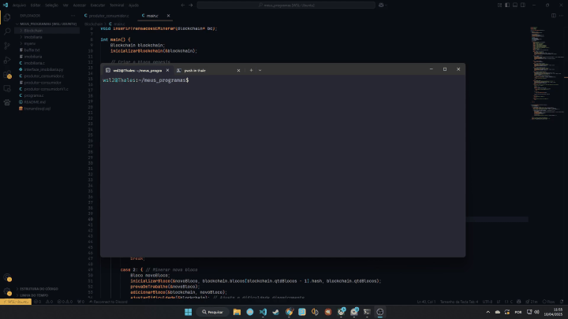

# 🧵 Produtor-Consumidor em C (com múltiplos processos)

> 💻 Projeto desenvolvido como exemplo do problema clássico *Produtor-Consumidor* utilizando **processos em C**, **sincronização via lock de arquivos** e leitura/escrita em um **buffer compartilhado (arquivo)**.



## 📦 Sobre o Projeto

Este programa implementa uma simulação do problema **Produtor-Consumidor**, onde:

- 🔁 **Produtores** geram números aleatórios e os escrevem em um arquivo `buffer.txt`
- 📤 **Consumidores** leem e removem o primeiro número do buffer
- 🔒 Sincronização é feita com um **arquivo de lock** (`buffer.txt.lock`) para garantir acesso exclusivo
- 🧬 Os processos são criados via `fork()`, permitindo rodar **vários produtores e consumidores** ao mesmo tempo

## 🚀 Como Compilar e Executar

### ✅ Requisitos
- Sistema UNIX (Linux, WSL, Mac)
- Compilador `gcc`

### 📦 Compilação
```bash
gcc produtor_consumidor.c -o produtor-consumidor
```

### ▶️ Execução
```bash
./produtor-consumidor <N_PRODUTORES> <N_CONSUMIDORES>
```

🔁 Exemplo com **3 produtores** e **2 consumidores**:
```bash
./produtor-consumidor 3 2
```

## 📂 Arquivos Gerados

| Arquivo           | Função                                                    |
|-------------------|------------------------------------------------------------|
| `buffer.txt`      | Buffer compartilhado entre produtores e consumidores 📄     |
| `buffer.txt.lock` | Lock para sincronização de acesso 🔐                       |
| `temp.txt`        | Arquivo temporário usado durante a remoção no consumo 🛠️    |

## 🔧 Estrutura Interna

- **`main()`**
  - Lê os parâmetros da linha de comando
  - Cria múltiplos produtores e consumidores com `fork()`
  - Instala handlers de sinal para limpar lock

- **`produtor()`**
  - Gera número aleatório
  - Espera pelo lock
  - Escreve no buffer
  - Libera lock

- **`consumidor()`**
  - Espera pelo lock
  - Lê e remove o primeiro número do buffer
  - Reescreve o restante
  - Libera lock

## 🛑 Encerramento Seguro

Pressione `Ctrl + C` para encerrar.  
Todos os processos irão:
- ⚠️ Remover o arquivo de lock, se existirem
- 💬 Imprimir mensagem informando o encerramento seguro

## 🧠 O que você aprende

✅ Gerenciamento de processos com `fork()`  
✅ Sincronização via lock de arquivos  
✅ Manipulação de arquivos em C  
✅ Tratamento de sinais (`SIGINT`, `SIGTERM`)  
✅ Concorrência básica sem semáforos  

## ✨ Possíveis Expansões

- 🔄 Versão com **memória compartilhada (`shm`)** e **semáforos POSIX**
- 📊 Monitoramento gráfico com Python
- 🧪 Sistema de logs com timestamps
- 🧹 Script de limpeza automática de buffer

## 👨‍💻 Autor

Feito com dedicação por um estudante de Engenharia da Computação no [CEFET/RJ](https://www.cefet-rj.br) 🧠⚙️  
Se curtiu o projeto, deixa uma ⭐ no repositório!


